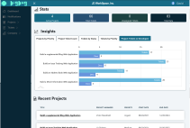

###### 
top

# BigBug

============

### This is an ASP.NET MVC C# relational database application.

---

 &nbsp; &nbsp; &nbsp; &nbsp; &nbsp; &nbsp;[Go To Website](https://bigbug-bugtracker.up.railway.app/)

---
<!-- TABLE OF CONTENTS -->

##  🚩 Table of Contents
1. [Features](#features)
2. [Built With](#built-with)
3. [License](#license)
4. [Contact](#contact)
4. [Acknowledgments](#acknowledgments)

---
### 🎨 Features
This project is a full-stack web application built with the ASP.NET framework using C# and the MVC design pattern to demonstrate and maintain the best practices of Separation of Concerns, Loose Coupling, and the SOLID principals. Other design patterns used include Interfaces with Services, Razor Syntax, Polymorphism, MVC Routing, Autorization and Authentication, LINQ, Dependancy Injection, Inheritance, Encapsulation and more. 

   Here are some of the features that this bug and issue tracking application contains:

    Role based authorization used to limit access to features base on user role.
    Register and create a company as the default administrator.
    Assign roles to company members.
    Create, edit and archive projects and tickets.
    Post comments to tickets.
    Add attachments to tickets.
    Assign project managers to projects.
    Assign company members to projects.
    Assign developers to tickets.
    Send notifications to yourself and/or other company members.
    And much more...

© Copyright David Bellerose Privacy | Terms & Conditions | Cookie Policy

(<a href="#top">back to top</a>)

---
### 🔨 Built With

* 
* 
* 
* 
* 
* 
* 
* 
* 
* 
* 
* 

(<a href="#top">back to top</a>)

---

<!-- LICENSE -->
## 📜 License

&copy; 2022 David Bellerose All Rights Reserved

### Permissions

 - This project and repository is for viewing and reference only
 - You are not allowed to copy the project and use it in its entirety
 - You may copy sections of code for your own use and manipulation within documents but not the full document itself

(<a href="#top">back to top</a>)

---

<!-- CONTACT -->
## 🔗 Contact

 📫 [Contact Me](https://external.ink?to=https://www.davidbellerose.com/)

 💼 [Portfolio](https://external.ink?to=https://www.davidbellerose.com)
 

(<a href="#top">back to top</a>)

---

<!-- ACKNOWLEDGMENTS -->
## Acknowledgments

* [Coder Foundry](https://external.ink?to=https://www.coderfoundry.com/)
* [Stack Overflow](https://external.ink?to=https://www.stackoverflow.com/)

(<a href="#top">back to top</a>)

